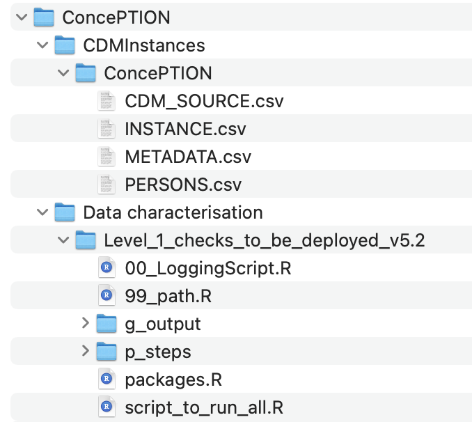

 

<!-- PROJECT LOGO -->
 

  
  

  
 <h3 align="center">Level 1 checks</h3>
 
 R scripts to check integrity of an ETL to the ConcePTION CDM 

 
<!-- TABLE OF CONTENTS -->

  
Table of Contents

  <ol>
    <li>
      <a href="#level-1-checks">Level 1 checks</a>
    </li>
    <li>
      <a href="#getting-started">Getting Started</a>
      <ul>
        <li><a href="#prerequisites">Prerequisites</a></li>
        <li><a href="#installation">Installation</a></li>
        <li><a href="#links">Data characterization study links</a></li> 
        <li><a href="#installation">Current version</a></li>
      </ul>
    </li>
    <li><a href="#license">License</a></li>
    <li><a href="#about-the-project">About the project</a></li>
    <li><a href="#funder">Funder</a></li>
    <li><a href="#citation">Citation</a></li>
    <li><a href="#contact">Contact</a></li>
  </ol>

<!-- Level 1 checks -->
## Level 1 checks

**Aims of Level 1 quality checks:**      
**1.**	To assess the integrity of the Extract-Transform-Load (ETL) process from the original data to the [ConcePTION CDM](https://docs.google.com/spreadsheets/d/1hc-TBOfEzRBthGP78ZWIa13C0RdhU7bK/edit#gid=413205035) for each Data Access Provider (DAP).           
**2.**	To provide feedback on the integrity of the ETL to the DAP iteratively for the refinement of the DAP's ETL procedure.    
**3.**  To produce high-level characterization of the data which has been ETL'd to the instance of the CDM in terms of presence/absence of CDM tables and columns, missingness in key variables, frequencies of categorical variables and distribution of dates and continuous variables.   

***Level 1 data checks review the completeness and content of each variable in each table of the D2 CDM to ensure that the required variables contain data and conform to the formats specified by the CDM specifications (e.g., data types, variable lengths, formats, acceptable values, etc.).*** 

**The level 1 checks are divided in 5 major steps:**   

***Step 1: Check the table formatting***     
Check if all rows of the .csv files in the working directory contain the correct number of fields.    
Check if all variables are present irrespective of their content.    
Check if variables are written in lowercase.     
Check for presence of mandatory variables as according to the CDM.    
Check for presence of non-mandatory variables by comparing between the table of interest and the information recorded in the METADATA table.    
Check presence of vocabularies for specific variables.    
Assess formats for all values and compare to a list of acceptable formats which have been filled out in the METADATA table.     

***Step 2: Missing data analysis***     
Tabulate missingness in all variables, overall and by calendar year (in the tables that contain a date variable).     
Missing data will be further stratified by meaning (in the tables that contain a meaning variable).    
Missing data overall will be displayed using bar charts for each CDM table and reported as counts and percentages.    
Missing data stratified by meaning or calendar year will be displayed using line charts for each CDM table and reported as counts and percentages.    
Missing data stratified by meaning and calendar year will be displayed using heat maps for each CDM table and reported as counts and percentages.     

***Step 3: Dates check***     
Check if dates are in the correct format (8 characters).      
Check if date variables contain allowable values, e.g:    
   * Year: 1995-present (exception for dates that represent end of follow up where years in the future will be allowed.)    
   * Month: 01-12    
   * Day: 01-31    

***Step 4: Check conventions and construct frequency tables of other and categorical variables.***    
Check if the table of interest contains any duplicate rows.    
Check that all conventions for the table of interest have been adhered to.     
Construct frequency tables of categorical variables, overall and by calendar year (when the table of interest contains a date variable).     
All frequency tables will be stratified by meaning when the table of interest contains a meaning variable.     
Results will be reported separately for variables with 2 or more categories.    
The results will be displayed graphically with bar charts or line charts.    

***Step 5: Distribution of continuous variables and date variables***    
For continuous variables mean, median, interquartile range, skewness and kurtosis will be reported.     
Distribution of date variables will be reported as counts of dates overall and by calendar year. All results will be stratified by the meaning variable if the table of interest contains one.    
Results will be displayed graphically with bar charts or line charts.    

***Subsection:***
Overview table with information on how counts in step 4 and 5 are being calculated.    

<!-- GETTING STARTED -->
## Getting Started

Follow the steps below to run Level 1 checks in your data.  

### Prerequisites

R version 4.1.0 (2021-05-18)

<!-- INSTALLATION -->
### Installation

Installation steps for Level 1 check: 

1.	Go to the GitHub page of Level 1 check
2.	Click the green button **Code** on the top of the GitHub page, download the ZIP folder using the **Download ZIP** button and extract the contents. Remember where you stored the extracted ZIP folder on your computer, you will use it later.
3.	Create a main folder with the name of your project (`Project_name`). We suggest to use a clear and short name, with no spaces in between example ConcePTION, Pfizer etc.  
4.	Create the folder `Data characterisation` inside the main folder `Project_name`. 
5.	Copy the folder `Level_1_checks_to_be_deployed_v5.2` from the extracted folder zip file that we downloaded in step 1 inside the new folder `Data characterisation`. 
6.	Create a folder named `CDMInstances` inside the main folder `Project_name`, which will be used to store the .csv files representing the CDM tables.
7.	Create a folder with the name of your project inside the `CDMInstances` folder (use the same name as in Step 2).
8.	Copy all your .csv data files (that follow the Common Data Model) within the folder created in Step 7.
9.	Go to the script *99_path.R* in the folder `Level_1_checks_to_be_deployed_v5.2`, and change the variable Studyname (line 6 in the code) to the name of your project. Make sure that the name of the folder created in the folder `CDMInstances` and the name of the variable match exactly. Save it.
10.	Open the *script_to_run_all.R*  script in **R-studio** and you are ready to run level 1 checks.

**Folder structure**

* [Project_name](./Project_name) (Main Folder)

    * [CDMInstances](./CDMInstances)
        * [Project_name](./CDMInstances/Project_name)
            * [files.csv](./CDMInstances/Project_name/files.csv) (here your files)    
     * [Data characterisation](./Data_characterisation) 
       * [Level_1_checks_to_be_deployed_v5.2](./Data_characterisation/Level_1_checks_to_be_deployed_v5.2)
       * [Level_2_checks_to_be_deployed2.0](./Data_characterisation/Level_2_checks_to_be_deployed2.0)
       * [Level_3_to_be_deployed1.0](./Data_characterisation/Level_3_to_be_deployed1.0)

**Folder structure example**

  
  

<!-- LINKS -->
### Data characterization study links   

[Level 1 checks](https://github.com/UMC-Utrecht-RWE/INSIGHT-Level1): Checking the integrity of the ETL procedure.     
[Level 2 checks](https://github.com/UMC-Utrecht-RWE/INSIGHT-Level2): Checking the logical relationship of the CDM tables.    
[Level 3 checks](https://github.com/UMC-Utrecht-RWE/INSIGHT-Level3): Benchamrking across DAPs and external sources.     

<!-- VERSION -->
### Current version

The current version of the script is 5.2.

<!-- LICENSE -->
## License

<!-- ABOUT-THE-PROJECT -->
## About the project
[ConcePTION](https://www.imi-conception.eu) aims to build an ecosystem that can use Real World Data (RWD) to generate Real World Evidence (RWE) that may be used for clinical and regulatory decision making, closing the big information gap of medication safety in pregnancy. As part of WP7, level checks were design to assess the quality of the data supporting RWE. Level checks described here has been successfully implemented in VAC4EU, EMA-tendered risk minimization studies, COVID vaccines effectiveness study, Post-Authorization Safety Studies, and CONSIGN. For details, please find the scientific pre-print article on INSIGHT [here](https://www.medrxiv.org/content/10.1101/2023.10.30.23297753v1) 

<!-- FUNDER -->
## Funder
The ConcePTION project has received funding from the Innovative Medicines Initiative 2 Joint Undertaking under grant agreement No 821520. This Joint Undertaking receives support from the European Union’s Horizon 2020 research and innovation programme and EFPIA

<!-- CITATION -->
## Citation

<!-- CONTACT -->
## Contact

Vjola Hoxhaj - v.hoxhaj@umcutrecht.nl

Project Link: [https://github.com/UMC-Utrecht-RWE/INSIGHT-Level1](https://github.com/UMC-Utrecht-RWE/INSIGHT-Level1)

